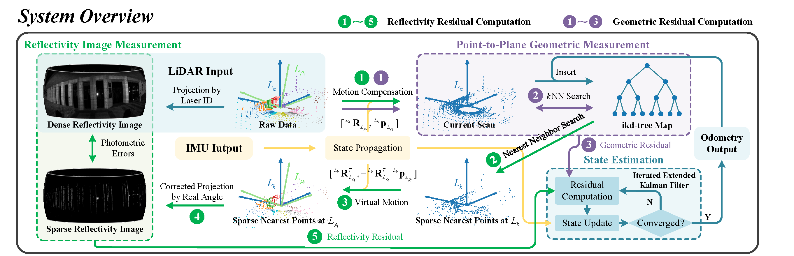
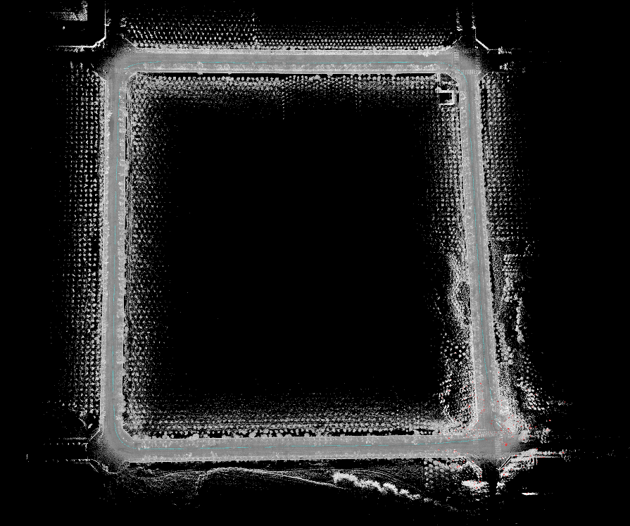
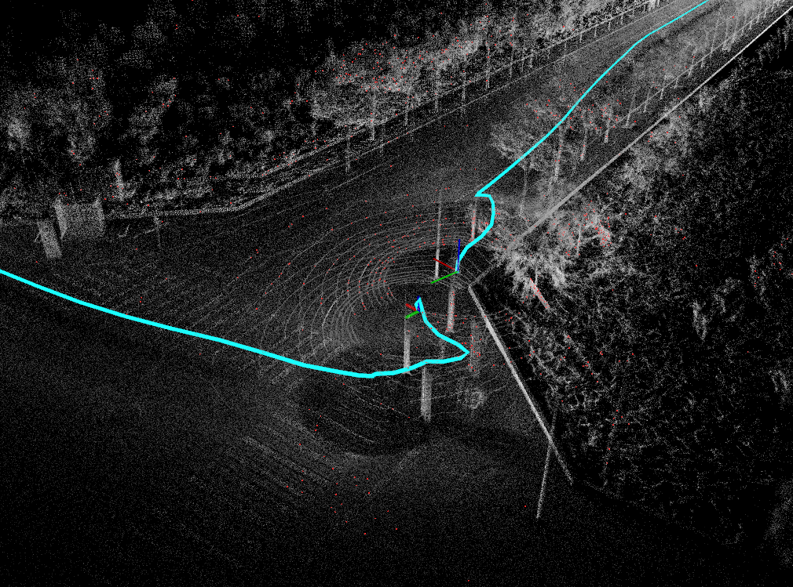
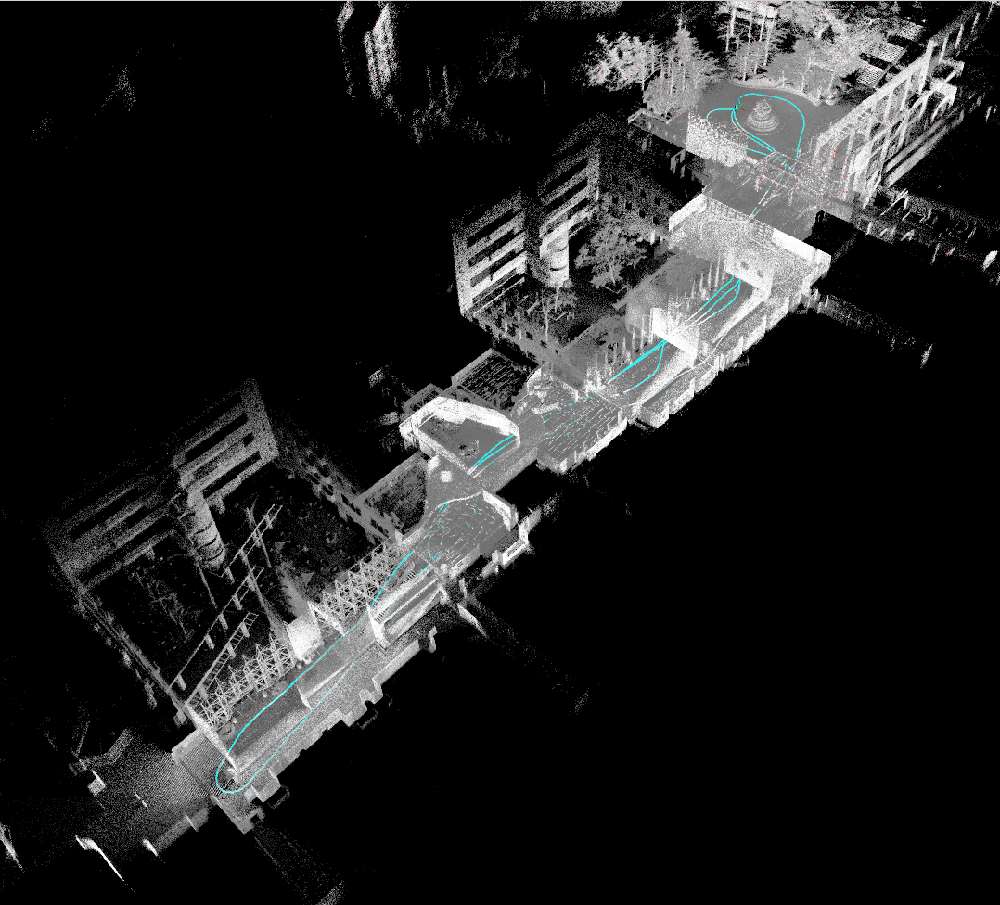
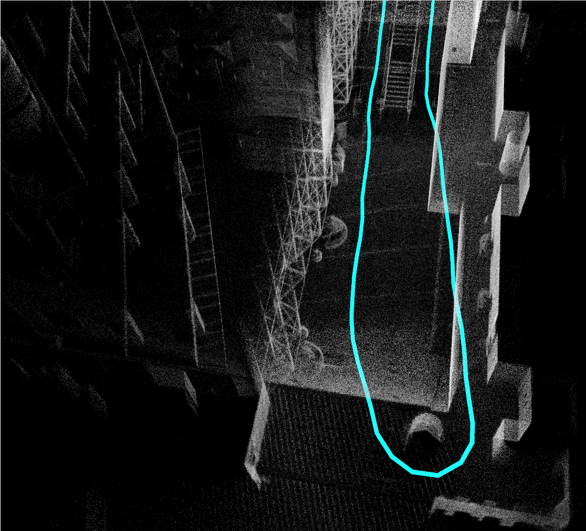

# RI-LIO
# Reflectivity Image Assisted Tightly-Coupled LiDAR-Inertial Odometry
# 1.Introduction
**RI-LIO** is a LiDAR-inertial odometry package that tightly couples reflectivity images. Its carefully designed framework can improve the robustness of pure LiDAR pose tracking and point cloud mapping with minimal system cost, especially in the rotation direction. It is suitable for use both in structured and unstructured environments and can be deployed on drones and unmanned vehicles. However, the package currently only supports Ouster-OS series LiDAR sensing devices. To apply it to other sensors, reflectivity and projection model need to be calibrated.

System architecture:
<div align="center">
    
</div>

# 2.Prerequisites

* Ubuntu18.04 or higher.
* ROS >= Melodic.
* **EIGEN >= 3.4.0**
* PCL >= 1.8
* OPENCV >= 3.2.0

# 3.Build
Clone the repository and catkin_make:
```shell
mkdir -p ~/$A_ROS_DIR$/src
cd ~/$A_ROS_DIR$/src
git clone https://github.com/RoboFeng/RI-LIO.git --recursive
cd ..
catkin_make
source devel/setup.bash
```

# 4.Prepare Sample Datasets
1. Our datasets. Some datasets that block geographic location information are coming soon.
2. [Fusionportable datasets](https://ram-lab.com/file/site/fusionportable/dataset/fusionportable/). Please download the data with suffix `*_ref.bag`.

# 5.Run RI-LIO
1. Run our datasets.

```shell
roslaunch rilio mapping_ouster128.launch
```
Some mapping results:

<div align="center">
    
    
</div>

2. Run Fusionportable datasets.

```shell
roslaunch rilio mapping_fusionportable.launch
```
Some mapping results:

<div align="center">
    
    
</div>

# 6.Apply RI-LIO on Your Own Sensors
1. Prepare the metadata file of your Ouster LiDAR. Refer to [ouster-ros](https://github.com/ouster-lidar/ouster-ros).
2. Run LiDAR projection model correction program.
```shell
roslaunch rilio correct_projection.launch lid_topic:=<LiDAR topic name> metadata_path:=<metadata file> out_path:=<projection calibration file>
```
3. Run your own LiDAR or play a rosbag.
4. Wait for the program execution to end.
5. Edit `config/ouster128.yaml` to set the below parameters:
    * lid_topic: LiDAR topic name
    * imu_topic: imu topic name
    * metadata_json: $metadata_path
    * calibration_json: $out_path
6. Run RI-LIO.
```shell
roslaunch rilio mapping_ouster128.launch
```


# Acknowledgments
* RI-LIO is developed based on [FAST-LIO2](https://github.com/hku-mars/FAST_LIO). Thanks for this outstanding work and its contributors.
* Please cite our work ([RI-LIO](https://ieeexplore.ieee.org/document/10041769)) if you are using our code.
```
@ARTICLE{10041769,
  author={Zhang, Yanfeng and Tian, Yunong and Wang, Wanguo and Yang, Guodong and Li, Zhishuo and Jing, Fengshui and Tan, Min},
  journal={IEEE Robotics and Automation Letters}, 
  title={RI-LIO: Reflectivity Image Assisted Tightly-Coupled LiDAR-Inertial Odometry}, 
  year={2023},
  volume={8},
  number={3},
  pages={1802-1809},
  doi={10.1109/LRA.2023.3243528}}

```
